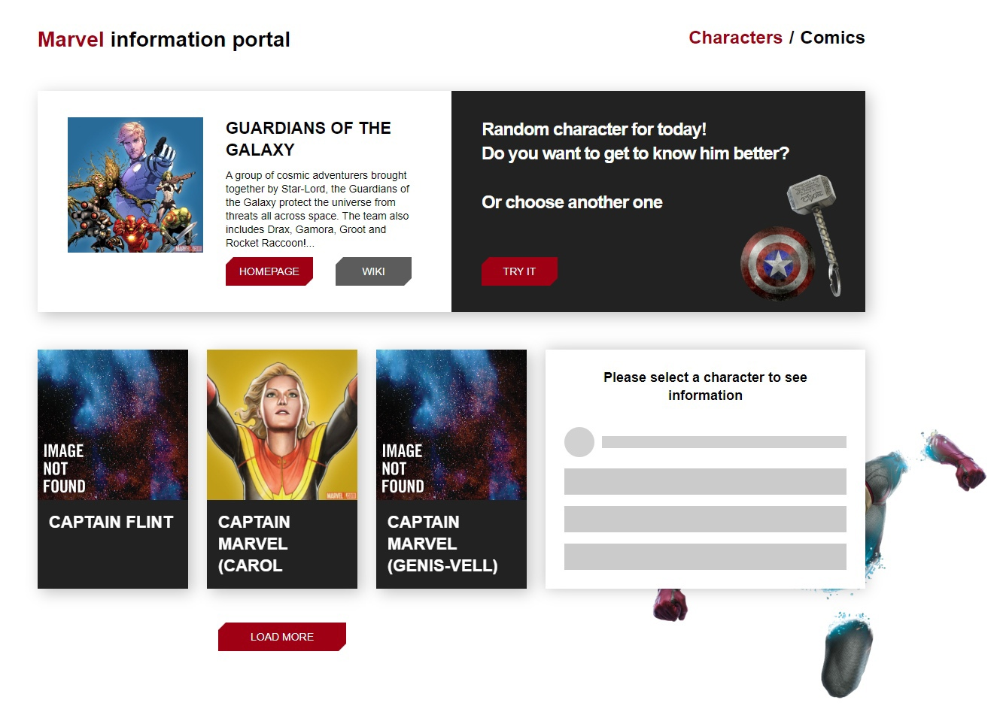

# Проект: react-marvel

### Обзор

- Интро
- gh-pages
- Figma

**Интро**

Проект создается на базе React.
Используется библиотека React Router для клиентского роутинга.

Возможности на данный момент:

- Подзагрузка полученного по запросу рандомного персонажа
- Дозагрузка по запросу дополнительных трех персонажей
- Карточка каждого загруженного персонажа открывается/обновляется справа
- Возможен переход на роутинг Comics
- На роутинге Comics загружаются рандомные комиксы и подзагружаются дполнительные комиксы по запросу
- Каждый комикс является ссылкой на свою страницу Comics/id
- С целью избежать лишних ререндеров в проекте используются хуки useMemo, useCallback

**gh-pages**

Сайт доступен по адресу [react-marvel](https://kovolga.github.io/react-marvel/)

**Figma**

Проект был выполнен в соответствии с предоставленным платформой Udemy макетом:
[Ссылка на макет в Figma](https://www.figma.com/file/xiC1B6ZlHvbiUK6FO3caxN/Marvel-DB?type=design&node-id=1883%3A212&t=tysI6uSz9TOHCOL2-1)
